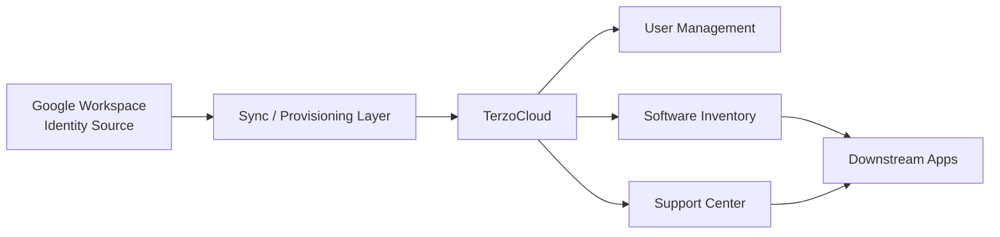

# TerzoCloud Provisioning Architecture

## Overview

TerzoCloud uses a mixed provisioning model:

- Google Workspace is the identity source
- TerzoCloud is the employee lifecycle and workflow control plane
- Downstream apps are categorized by provisioning method:
  - `SCIM`
  - `API`
  - `SSO Only`
  - `Manual`

## Architecture

## Software Inventory Fields

Each software record includes:

- `provisioningMethod`
- `connectorType`
- `supportsDeprovision`
- `provisioningNotes`

These fields tell Support Center how to treat application access tasks.

## Workflow Rules

### SCIM

- Use for apps with direct lifecycle support
- Keep software admins as task owners for visibility
- Mark task metadata as `SCIM`
- Show deprovision readiness when supported

### API

- Use when the app has a supported connector or custom API path
- Keep the task visible so admins can monitor completion
- Store connector details in `connectorType`

### SSO Only

- Use when the app supports centralized login but not account lifecycle
- Keep provisioning tasks manual
- Use notes to describe the sign-in-only behavior

### Manual

- Use when there is no SCIM or API automation
- Route task to software admins
- Use provisioning notes for runbook steps

## Operational Guidance

- Keep employee lifecycle sourced from Google Workspace
- Use TerzoCloud to orchestrate onboarding, access changes, and offboarding
- Do not require every app to support SCIM
- Track automation method per app and surface it in Support Center tasks
